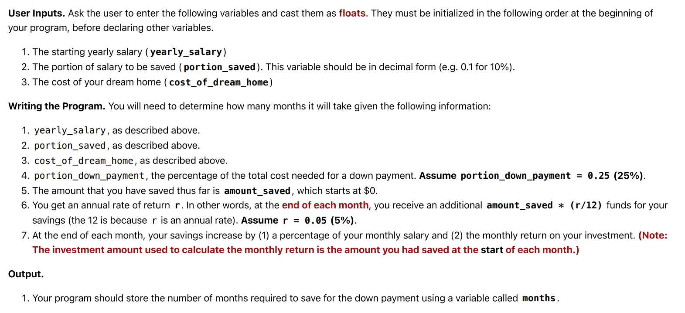

#### Objectives
- Introduction to control flow in Python
- Formulating a computational solution to a problem
- Exploring bisection search

## Part A: Saving for a House
Your goal is to find the number of months it takes to save up for a down payment. The cost of your down payment is calculated by multiplying the total cost of your dream house by the down payment percentage.

